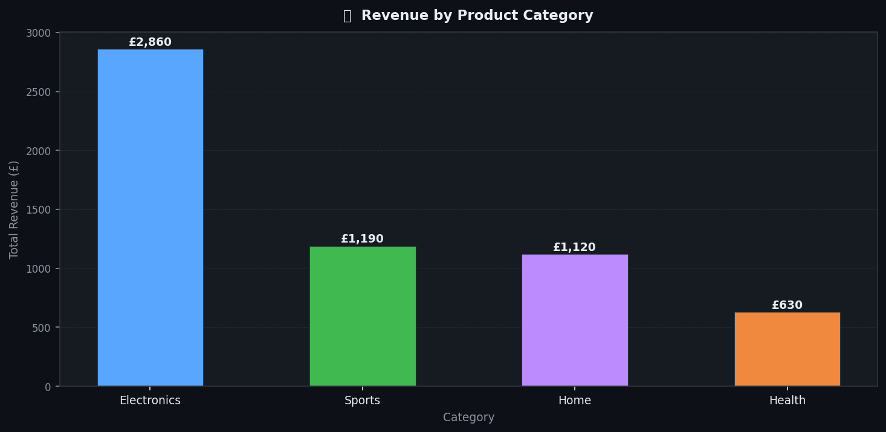
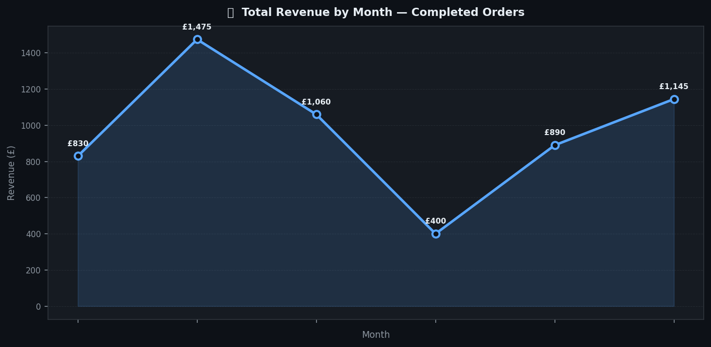

# SQL Data Analysis — E-Commerce Orders

## Overview
A series of SQL queries analysing e-commerce order data to surface actionable business insights around revenue, customer retention, and product performance.

## Problem
Businesses generate large volumes of transactional data but often lack the analysis to understand what's driving revenue and where customers are dropping off.

## Solution
Using a sample e-commerce dataset, I wrote structured SQL queries to answer real business questions across sales, retention, and segmentation.

## Tech Stack
- SQL (SQLite / PostgreSQL compatible)
- Python (database generation)
- Matplotlib (data visualisation)

## Queries Included
| Query | Business Question |
|---|---|
| `total_revenue.sql` | What is total revenue by month? |
| `top_products.sql` | Which products drive the most sales? |
| `customer_retention.sql` | What % of customers return after first purchase? |
| `revenue_by_category.sql` | Which category generates the most revenue? |

## Screenshots






## Sample Insight
> Returning and loyal buyers represent the highest lifetime value customers — retention strategy should prioritise this segment.

## How to Run
```bash
# Step 1 — Generate the database
python create_database.py

# Step 2 — Open the database
sqlite3 ecommerce.db

# Step 3 — Run a query
.read total_revenue.sql
```

## Key Learnings
- Writing multi-table JOINs for customer and order data
- Using window functions for retention cohort analysis
- Translating SQL output into business recommendations

## Next Steps
- Connect to a live database via Python (psycopg2)
- Build a visual dashboard using Tableau or Looker Studio
- Add A/B test analysis queries
